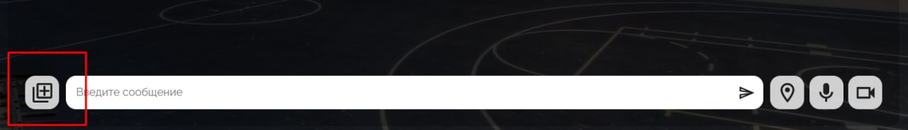
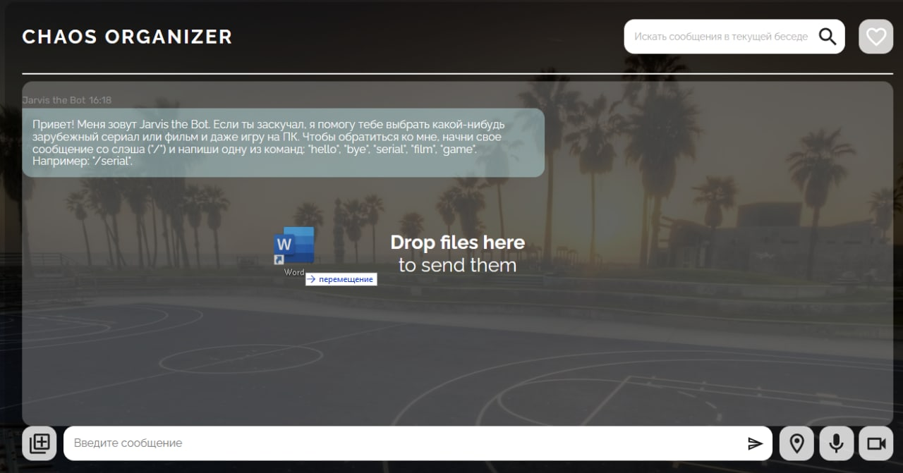
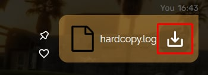
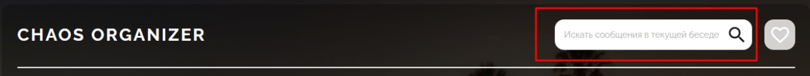
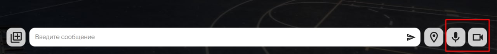
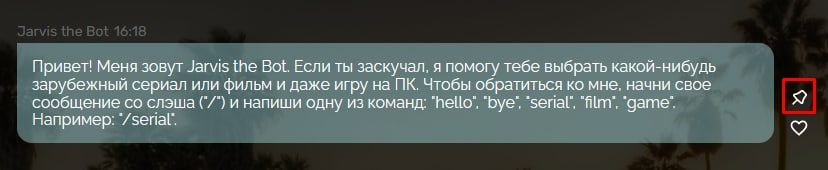
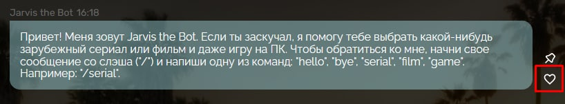

# Chaos Organizer

[CHAOS Organizer](https://kosatos.github.io/ahj-diploma/)

## Обязательные для реализации функции

- Сохранение в истории ссылок и текстовых сообщений✅
Все сообщения хранятся на сервере в отдельном массиве.
- Ссылки (то, что начинается с http:// или https://) должны быть кликабельны и отображаться как ссылки✅
Ссылки, отправляемые в сообщении, фильтруются с помощью функции _textfilter_.
- Сохранение в истории изображений, видео и аудио (как файлов) - через Drag & Drop и через иконку загрузки (скрепка в большинстве мессенджеров)✅
Добавление файлов производится с помощью кнопки (функция _changeHandler_), слева от тектового инпута. 
Также файлы можно добавить с помощью перетаскивания (функция _dragndrop_). 
Все файлы также хранятся на сервере в массиве с сообщениями.
- Скачивание файлов (на компьютер пользователя)✅
Чтобы скачать файл, необходимо навести на сообщение с файлом и нажать на всплывающую кнопку. 

- Ленивая подгрузка: сначала подгружаются последние 10 сообщений, при прокрутке вверх подгружаются следующие 10 и т.д.✅
При обновлении страницы или открытии ее с другого устройства/браузера, сообщения подгружаются начиная с последних десяти.

## Дополнительные для реализации функции

- Синхронизация - если приложение открыто в нескольких окнах (вкладках), то контент должен быть синхронизирован✅
Контент синхронизируется благодаря отправки серверу запроса на инициализацию (_init_), который в свою очередь возвращает сообщениния, которые лежат на уже записаны на сервер.
- Поиск по сообщениям (интерфейс + реализация на сервере)✅
Сообщения можно найти с помощью строки ввода в верхней части приложения, благодаря отправки серверу запроса на поиск сообщения (_search_), который по переданному значению вернет сообщения, которые соответствуют значению запроса. 
- Запись видео и аудио (используя API браузера)✅
Запись видео и аудио осуществляется с помощью кнопок справа от тествого инпута. Реализация описана в классе _AudioVideoRecorder_. 
- Отправка геолокации✅
Отправка геолокации осуществляется первой кнопкой справа от тектового поля с помощью функции _getPosition_. 
- Воспроизведение видео/аудио (используя API браузера)✅
Записанные аудио и видео добавляются в сообщение путем отправки данных на сервер, который в свою очередь возвращает готовое сообщение и через класс _Message_ инициализирует его на странице.
- Отправка команд боту, например: @chaos: погода, бот должен отвечать рандомный прогноз погоды (интегрироваться с реальными сервисами не требуется), команд должно быть не менее 5✅
Реализация работы бота описана в классе _ChatBot_.
- Закрепление (pin) сообщений, закреплять можно только одно сообщение (прикрепляется к верхней части страницы)✅
Чтобы закрепить сообщение необходимо навести на сообщение и нажать на всплывающую кнопку. Закрепленное сообщение отображается в верхней части приложения с помощью функции _createPinned_. 
- Добавление сообщения в избранное (тогда должен быть интерфейс для просмотра избранного)✅
Чтобы добавить сообщение в избранное необходимо навести на сообщение и нажать на всплывающую кнопку. 
Избранное сообщение отображается если нажать на кнопку для показа избранных сообщений в верхней правом углу. 